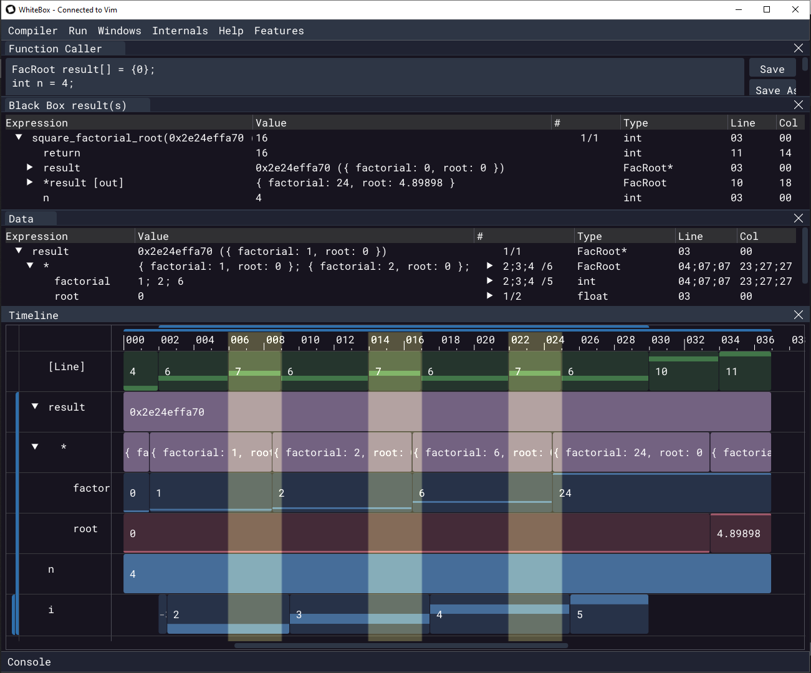

= WhiteBox
Andrew Reece <andrew@whitebox.systems>; WhiteBox Systems <hi@whitebox.systems>
include::VERSION[]
:doctype: book
:media: print
:optimize:
:revdate: {docdate}
:sectanchors:
:source-highlighter: rouge
:title-page:
:toc:
:toclevels: 3
:toctitle: Contents

== Overview
NOTE: We want this manual to be as helpful as possible. Please let us know if anything is unclear or there is any other information you would like to see here.

WhiteBox is a tool for showing you how your code behaves as you write it. We sometimes refer to it as a "live debugger".
It automatically compiles, runs, and debugs the function you're browsing or editing.
It makes feedback about how your code executes always-available alongside your favourite editor
to help you to have a better mental model of your code, iterate on designs faster, and catch errors as you introduce them.

WARNING: This is an early release of WhiteBox. It still contains bugs and doesn't yet have all the features planned.
Reporting any issues you find will help us to fix them faster, so please email them to us at bugs@whitebox.systems.

Currently supported editors ::
- 4coder
- Emacs
- Notepad++
- Vim/Neovim

Currently supported platforms ::
- Windows x86-64
- Linux x86-64

Language support ::
- All versions of C supported by clang
- Basic C++ features (classes, methods, namespaces, references). Please note that WhiteBox may crash or behave oddly if used with other C++ features.

== Getting Started
The first thing to do is to install the plugin for your editor so that WhiteBox can stay updated on the code your working on.

Once you've installed it, you can connect it to WhiteBox and start editing code!

=== Additional Linux Setup
. To make sure the executables can run properly, run the following commands from the `whitebox` directory: +
`chmod +x whitebox` +
`chmod +x dbg_run` +

. Try running `./whitebox` from the terminal to see if the executable will open.
You may get an error saying that you're missing some libraries.
If so, install them with your plugin's package manager, for example on Ubuntu: +
`apt-get install libglfw3`
// TODO: list of libraries?

. Continue with the plugin setup as normal.

=== Editor plugin setup
WhiteBox can connect to several editors via a plugin.
Generally we’ve tried to go with the standard approach for each editor.

The plugin files for each editor can be found under their own name in the `whitebox/editor_plugins` folder.

<<<
==== 4coder
===== Install
_Location:_ `whitebox/editor_plugins/4coder`

If you haven’t customized your build, replace the `custom_4coder.dll` in the `4coder` Program Files directory with the one from the `editor_plugins\4coder` directory.

Otherwise, if you are using a custom build, you need to update your tick function to call WhiteBox’s:

[source,cpp]
----
#include "whitebox_4coder.cpp"
// ...
// Option 1 - if you haven't customized the tick function:
set_custom_hook(app, HookID_Tick, wb_4c_default_tick);

// Option 2 - if you have customized the tick function:
function void my_custom_tick(Application_Links *app, Frame_Info frame_info) {
    // ...
    wb_4c_tick(app, view);
}

// ...

set_custom_hook(app, HookID_Tick, my_custom_tick);
----

You can see `whitebox_4coder_bindings_sample.cpp` for a complete example.

===== Connect

// auto-check on editor open
. Make sure WhiteBox is open
. Open the commands menu (`Alt+X` by default)
. Call the command `whitebox_connect`
. A status message should appear in the messages window

===== Other commands
WhiteBox will automatically disconnect from the editor when closed.
If you would like to disconnect manually, follow the same method as above but use the `whitebox_disconnect` command.
You can also check whether this instance of 4coder is connected to WhiteBox with the `whitebox_connection_check` command.

<<<
==== Emacs
===== Install
_Location:_ `whitebox/editor_plugins/emacs`

If you’re using a particular plugin manager then follow the normal instructions for that.

Otherwise put the following command in your `.emacs` or `init.el` config file to run every time Emacs is opened:

[source,elisp]
----
(load-file "/path/to/whitebox/editor_plugins/emacs/whitebox.el")
----
// M-: to eval the expr

To just enable the WhiteBox plugin for the current session run:
[source,elisp]
----
M-x load-file /path/to/whitebox/editor_plugins/emacs/whitebox.el
----

(Make sure to edit the path as needed.)

===== Connect

// auto-check on editor open
. Make sure WhiteBox is open
. Run the command `M-x whitebox-mode` to toggle on whitebox-mode
. The connection status will appear in Emacs' lower status bar

===== Other commands
WhiteBox will automatically disconnect from the editor when closed.
If you would like to disconnect manually, run `M-x whitebox-mode` again or run `M-x whitebox-disconnect`.
You can also check whether this instance of Emacs is connected to WhiteBox by running `M-x whitebox-connection-check`

<<<
==== Notepad++
===== Install
_Location:_ `whitebox/editor_plugins/Notepad++`

Copy the whitebox folder (the folder itself, not just the contents) into the plugins folder for Notepad++, e.g:

`C:\Program Files\Notepad++\plugins`

===== Connect

// auto-check on editor open
. Make sure WhiteBox is open
. Open the WhiteBox plugin menu (`Menu Bar > Plugins > WhiteBox`)
. Select `Connect`

===== Other commands
WhiteBox will automatically disconnect from the editor when closed.
If you would like to disconnect manually, follow the same method as above but select `Disconnect`.
You can also check whether this instance of Notepad++ is connected to WhiteBox by selecting `Is connected?`

<<<
==== Vim/Neovim
===== Install
_Vim Location:_ `whitebox/editor_plugins/whitebox-vim`
_Neovim Location:_ `whitebox/editor_plugins/whitebox-nvim`

If you’re using a particular plugin manager then follow the normal instructions for that.

Otherwise add the corresponding line to your .vimrc (and edit the path as needed):

[source,vim]
----
source C:\Program Files\whitebox\editor_plugins\whitebox-vim\plugin\whitebox.vim
source C:\Program Files\whitebox\editor_plugins\whitebox-nvim\plugin\whitebox.vim
----

===== Connect

// auto-check on editor open
. Make sure WhiteBox is open
. Run the command `:call WhiteBoxConnect()`
. The connection status will appear in Vim's lower status bar

===== Other commands
WhiteBox will automatically disconnect from the editor when closed.
If you would like to disconnect manually, run `:call WhiteBoxDisconnect()`.
You can also check whether this instance of Vim is connected to WhiteBox by running `:call WhiteBoxConnectionCheck()`

<<<
=== Interaction flow overview

This is what a typical interaction might look like (it's not prescriptive).

|===
| *Your Action*                                 | *WhiteBox's response*
| Open some C code in your editor               |
| Open up WhiteBox and connect to it            | Acknowledge connection
| Move your cursor into a function              | Detect what the function is; try to compile and run it with some default arguments
| Edit the arguments to something more suitable | Immediately re-run with those parameters
| Move your cursor around the function          | Show some location-dependent information (see <<GUI Overview>>)
| Edit the code (without saving)                | Desaturate its feedback as it may no longer be valid (the location information may have changed)
| Save the file                                 | Recompile and rerun the function being worked on
|===

== GUI Overview

Let's go through the GUI elements and find out what each of them do.

The examples below are based on running WhiteBox with the following C code:

.Source Code for GUI Examples
[source,c,linenums]
----
typedef struct { int factorial; float root; } FacRoot;

int square_factorial_root(FacRoot *result, int n) {
    result->factorial = 1; // NOTE: this is still correct when n=0 or n=1

    for (int i = 2; i <= n; ++i) {
        result->factorial *= i;
    }

    result->root = sqrt(result->factorial);
    return n * n;
}
----

.Typical View of Main Screen

<<<
=== Function Caller

.Function Caller: Code Specifying Inputs to Function

This is the area in which you provide arguments for the function you are editing.
It is just a straightforward code block, so it can call the function multiple times or include features like loops.

When you first move your cursor into a function that WhiteBox hasn't seen before, WhiteBox will try to generate some valid default arguments to call the function with.
It will reuse the last valid arguments if WhiteBox recognizes the function.

.Default Generated Function Caller
[source%linenums,c]
----
FacRoot result[] = {0};
int n = 0;

square_factorial_root(result, n);
----

.Function Caller GUI Buttons
[cols="1,4"]
|===
| *Button*  | *Function*
| `Save`    | Save the current version of the function caller with the given name
| `Save As` | Save the current version of the function caller with a new name
| `List`    | View and load all saved callers
| `Revert`  | Change the caller back to how it was when it was saved
| `Default` | Re-generate the valid default arguments
|===

<<<
=== Black Box
.Black Box: Function Input/Output

This shows what outputs were produced by calling the function with the given inputs.

It shows the state of the argument variables at the point in time that the function was called (including for pointer dereferences),
as well as the return value(s).

It's common in C(++) to use pointers to return additional values, so non-`const` pointer arguments also show their dereferenced value at the point in time that the function returned. These are labeled as `[out]`.

If the function was called multiple times via the <<Function Caller>> or recursion, these are all shown in the sequence/structure in which they occurred.

See the next section for explanation of the table's columns.

<<<
=== Data Tree

.Data Tree with Multiple Changes at the Cursor "Breakpoint"
image::img/gui_data_tree.png[]

This is a view similar to the 'Watch' window in a normal debugger, with a few extra features.

If the cursor is in a function that has been compiled and run, the data tree will show variable values as if there were a debugger breakpoint at the cursor.
For loops, this results in multiple values being shown: one for each iteration. +
Red values indicate what has just changed at the cursor "breakpoint".

.List of Value Changes for Data Tree Expressions
image::img/gui_data_tree_changes_graph.png[]
Because WhiteBox has recorded all of the data changes over time, it can show every value that a variable had. If the variable is a number (e.g. `int`, `float`, `uint8_t`), you can also graph the changes.

<<<
[cols="1,7"]
|===
| *Column*     | *Explanation*
| `Expression` | The data being presented; e.g. a variable, data accessed via pointer, struct member. +
Expand this element to see its inner members, e.g. if this is a struct/class/array/pointer.
| `Value`      | The value(s) at the point(s) in the execution when the cursor is passed (as if there were a breakpoint at the cursor)
| `#`          | The 'Change Number': how many times the expression's value has changed up to the current point(s) in the execution, followed by the total number of changes recorded. +
`<current_change_number> / <total_number_of_changes>` +
Expand this element to see all of the recorded changes to the expression
| `Type`       | The datatype of the expression, e.g. `int`, `float const *`, `struct MyData`
| `Line`       | The line(s) in the source code at which this value change occurred
| `Col`        | The column(s) in the source code at which this value change occurred
|===
// TODO: colours

<<<
==== Display options

.Context Menu in Data Tree
image::img/gui_data_tree_options.png[]

Right clicking on an expression brings up a context menu to customize options specific to that expression.
Right clicking anywhere else on the table lets you customize the global options, which apply unless overrided by expression-specific options.

[cols="3,3,9,3"]
|===
| *Display option* | *Context* | *Explanation* | *Default*
// TODO: option tree
| `Revert to parent data display options` | Options have been specified for the expression | Use the global options                                                                                                                                              |
| `Array count`                           | The expression is a pointer or array           | Determines how many array elements to show. If increased beyond the data already recorded, this will trigger the function to run again so that they can be observed | pointers: `1` +
arrays: declared length
| `Array newlines`                        | Always                                         | In the value preview, print arrays with each element on a new line                                                                                                  | `Off`
| `Struct member names`                   | Always                                         | In the value preview, for structs/classes/unions, print the name of each member before its value                                                                    | `On`
| `Data addresses`                        | Always                                         | Show the address of the expression, typically the equivalent of `&variable`                                                                                         | `Off`
| `Show graphs`                           | Always                                         | Graph all of the changes for numerical values                                                                                                                       | `Off`
| `<number base>`                         | Always                                         | Determine which base numerical values should be written in from [Decimal/10, Hexadecimal/16, Binary/2, Octal/8]                                                                                           | `Decimal`
|===

<<<
=== Timeline

.Timeline of Data Changes Per Expression; Highlighted Cursor Position(s)

The timeline is one of the more unusual features in WhiteBox.
It is somewhat similar to the timeline in a video editor: the X-axis corresponds to discretized time and the Y-axis has a number of separate tracks.

Each track corresponds to an expression, the same as a row in the <<Data Tree>>. On each track there are multiple bars: each bar corresponds to a value change for the expression.
Gaps appear in the track when that expression/variable was not in scope.
The colours of each track correspond to the datatype of the expression.
// TODO: more?

There are vertical highlights on the timeline for each point in the execution where the cursor "breakpoint" was hit.

.Timeline Navigation
|===
| *Control*                   | *Effect*
| `Scroll Up/Down`            | Move up/down
| `Shift + Scroll Up/Down`    | Move left/right
| `Ctrl + Scroll Up/Down`     | Zoom in/out (centred on cursor), changing the X-axis scale
| `Middle-click + drag`       | Pan around
| `Hover mouse over elements` | Show tooltip with expanded information
|===

////
.Timeline Navigation Controls
[horizontal]
`Scroll Up/Down`            :: Move up/down
`Shift + Scroll Up/Down`    :: Move left/right
`Ctrl + Scroll Up/Down`     :: Zoom in/out (centred on cursor), changing the X-axis scale
`Middle-click + drag`       :: Pan around
`Hover mouse over elements` :: Show tooltip with expanded information
////

The X- and Y-axis scales can both be edited manually with the `Scale` sliders

=== Status bar
image::img/gui_status_bar.png[]
image::img/gui_status_bar_error.png[]

Indicates issues during connection, compiling or runtime.
The colour indicates severity.
See <<Status Feedback>> for more details.

== Status Feedback
The status of the WhiteBox and the actions it takes is presented in 3 ways:

[cols="1,4"]
|===
| *Feedback method* | *Information type*
| Window title bar  | Editor connection status
| GUI status bar    | Issues from recent connection/compilation/run attempt
| Terminal          | Extended error information, particularly compilation error messages and warnings
|===

== Menus

=== Compiler
Options related to compiling code.

C and C++ code is compiled using LLVM/Clang libraries, so options use the formatting for these.
Fortunately clang includes most of the extensions provided by other compilers.

[cols="1,6"]
|===
| *Menu Item* | *Explanation*
| `Recompile` | Manually trigger a recompile and rerun, in case something hasn't updated properly. +
If you have to use this, something has probably gone wrong, so please let us know.
| `Preferences` | Opens a new menu for determining compiler flags, object files and DLLs/shared objects
| `Root file` | The file that gets passed to the internal compiler. +
By default WhiteBox will use the file you're editing, however you may have your code structured as a unity build and be editing a file that has been `#included` by another. +
In this case the compiler may need access to functions and types included before the file you're editing.
|===

// TODO: ==== Preferences

=== Internals
Miscellaneous views on some of WhiteBox's internals.
These are not expected or intended to be key debugging tools, but may be of interest.

[cols="1,4"]
|===
| *Menu Item*          | *Explanation*
| `Pagelet viewer`     | Similar to `Memory` views in debuggers, this presents 2048-byte chunks of memory and all the changes they go through.
| `Execution timeline` | Show what LLVM IR instructions were run, in order
| `Registers window`   | Show all the register values at each sample
| `Debug Info Entries` | Show all the information nodes in the DWARF debug data tree
| `Functions Compiled` | List the functions currently compiled (lazily or eagerly) and any breakpoints placed
| `SQL Status`         | Show miscellaneous information about the SQL database
| `LUV texture`        | Explore the LUV colourspace used for the timeline colours
|===

== Troubleshooting

=== Compilation Errors

==== `#include <X>` file not found
WhiteBox's internal compiler (clang) can't find the file.
This may be because the file doesn't exist, but it is more likely that the directory that contains the file is not among the searched include paths.
To add the directory to the include paths, go to `Main menu > Compiler > Preferences`, and add a compiler flag such as:

----
-I <1>
/path/to/include/file/directory <2>
----
<1> Make sure that there is a newline between the `-I` and the path.
<2> This is the path to the directory for the file, not to the file itself.

If you are unsure where the include file is located, you can do the following:

Linux:: Run this command in the terminal: `find /usr | grep my_include_file`
Windows:: Search My Computer with the name of the include file, right-click on the file and select `Open file location`.

=== Crashes & Internal Errors

If WhiteBox ever fails an assertion about its internal condition, it should leave an error message on the terminal:
[source]
----
Internal Error: A message with context about what went wrong <1>

Assertion failed in `function_name` - ../app.c(123): <2>
    something_that_should_be_correct <3>
    GetLastError() => 0: The operation completed successfully. <4>
----

<1> A message with context about what went wrong
<2> Function, file and line information
<3> The condition that failed
<4> An OS error number that may or may not be related to the issue in question.

It should also produce a dump file (`<timestamp>.dmp`). +
Please relay these back to us along with any other bug information to help us fix the issue faster.

This error box will also appear. `Abort` will close WhiteBox, `Retry` will pause execution if connected to a debugger, `Ignore` will try to continue running even though the assertion failed.
It's not recommended to `Ignore` as data may be corrupted.

==== WhiteBox crashed when I opened it
You probably tried to open and connect to multiple instances of WhiteBox simultaneously, this is currently not supported.
You may have luck specifying the port number by opening WhiteBox with `--port <portnum>` and modifying the port number in your plugin accordingly.

==== A series of actions causes WhiteBox to crash
If you run WhiteBox with `--record-actions <filename>`, it will record a log of the actions you took to the given filename.
If the bug is repeatable (i.e. it happens consistently every time you do the same actions), it should hopefully be recreated
if you run WhiteBox again with `--replay-actions <filename>`.
If it does, please send this to us as well to help with debugging efforts.

==== WhiteBox is not responding
Consider whether the code you're running has hit an infinite loop.
You may have to manually force close WhiteBox and reopen it.
(Making running code cancellable is something to be added shortly.)

==== A particular function caller is causing WhiteBox to hang or consistently crash
If it is not possible to edit the function caller through WhiteBox because it keeps trying to run before you can change anything, there are 2 potential fixes:

. Delete the `whitebox.db` database file. WhiteBox will create a fresh database if it cannot find an existing one.
. Edit the `whitebox.db` database file. It is a standard SQLite database so is editable with common tools, e.g. https://sqlitebrowser.org/

// [index]
// == Index
// ((TERM)) for inline index terms
// (((TERM1, TERM2...))) for hidden index terms

=== Inconsistent feedback
If WhiteBox stops behaving as expected, close, open, and reconnect to it again, and see if that fixes the issue.
Please mailto:bugs@whitebox.systems[email us^] a description of the problem either way.
// ?subject=WhiteBox%20Bug Report,"WhiteBox version:\nOS (Windows/Linux):\nEditor:\nBug description:
