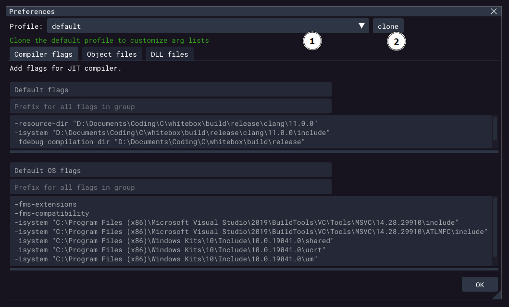

= WhiteBox
Andrew Reece <andrew@whitebox.systems>; WhiteBox Systems <hi@whitebox.systems>
include::VERSION[]
:doctype: book
:media: print
:optimize:
:revdate: {docdate}
:sectanchors:
:source-highlighter: rouge
:title-page:
:toc:
:toclevels: 3
:toctitle: Contents

== Overview
NOTE: We want this manual to be as helpful as possible. Please let us know if anything is unclear or there is any other information you would like to see here.

WhiteBox is a tool for showing you how your code behaves as you write it. We sometimes refer to it as a "live debugger".
It automatically compiles, runs, and debugs the function you're browsing or editing.
It makes feedback about how your code executes always-available alongside your favourite editor
to help you to have a better mental model of your code, iterate on designs faster, and catch errors as you introduce them.

WARNING: This is an early release of WhiteBox. It still contains bugs and doesn't yet have all the features planned.
Reporting any issues you find will help us to fix them faster, so please email them to us at bugs@whitebox.systems or use `Help > File bug report...`.

Currently supported editors ::
- 4coder
- 10x
- Emacs
- Notepad++
- Sublime Text
- Vim/Neovim
- Visual Studio
- VSCode

Currently supported platforms ::
- Windows x86-64
- Linux x86-64

Language support ::
- All versions of C supported by clang
- Basic C\++ features (classes, methods, namespaces, references). Please note that WhiteBox may crash or behave oddly if used with other C++ features.
  WhiteBox will currently fail to load files that include templates.

== Getting Started
The first thing to do is to install the plugin for your editor so that WhiteBox can stay updated on the code your working on.

Once you've installed it, you can connect it to WhiteBox and start editing code!

=== Additional Linux Setup
. To make sure the executables can run properly, run the following commands from the `whitebox/whitebox_vX.YY.Z` directory: +
`chmod +x whitebox dbg_run ../launch_whitebox`

. Try running `./whitebox` from the terminal to see if the executable will open.
You may get an error saying that you're missing some libraries.
If so, install them with your plugin's package manager, for example on Ubuntu: +
`apt-get install libglfw3`
// TODO: list of libraries?

. Continue with the plugin setup as normal.

=== Editor plugin setup
WhiteBox can connect to several editors via a plugin.
Generally we’ve tried to go with the standard approach for each editor.

The plugin files for each editor can be found under their own name in the `whitebox/editor_plugins` folder.

<<<
==== 4coder
===== Install
_Location:_ `whitebox/editor_plugins/4coder`

If you haven’t customized your build, replace the `custom_4coder.dll` in the `4coder` Program Files directory with the one from the `editor_plugins\4coder` directory.

Otherwise, if you are using a custom build, you need to update your tick function to call WhiteBox’s:

[source,cpp]
----
#include "whitebox_4coder.cpp"
// ...
// Option 1 - if you haven't customized the tick function:
set_custom_hook(app, HookID_Tick, wb_4c_default_tick);

// Option 2 - if you have customized the tick function:
function void my_custom_tick(Application_Links *app, Frame_Info frame_info) {
    // ...
    wb_4c_tick(app, view);
}

// ...

set_custom_hook(app, HookID_Tick, my_custom_tick);
----

You can see `whitebox_4coder_bindings_sample.cpp` for a complete example.

===== Connect

// auto-check on editor open
. Make sure WhiteBox is open
. Open the commands menu (`Alt+X` by default)
. Call the command `whitebox_connect`
. A status message should appear in the messages window

===== Other commands
WhiteBox will automatically disconnect from the editor when closed.
If you would like to disconnect manually, follow the same method as above but use the `whitebox_disconnect` command.
You can also check whether this instance of 4coder is connected to WhiteBox with the `whitebox_connection_check` command.

<<<
==== 10x
===== Install
====== Automatic installation

Click on `Install Plugin` to have WhiteBox automatically copy the plugin into 10x's scripts folder.

====== Manual installation

_File:_ `whitebox/editor_plugins/10x/WhiteBox.py`

If automatic installation fails or is unavailable, you can manually install the 10x plugin by copying the `Whitebox.py` file into 10x's scripts folder.

10x stores its plugin scripts in the folder `%AppData%\10x\PythonScripts\`, which typically evaluates to:

`C:\Users\<username>\AppData\Roaming\10x\PythonScripts\`

(Make sure to edit the path to replace `<username>` with your user name as needed.)

After copying `WhiteBox.py` into that folder, restart 10x to detect the plugin.

===== Connect

. Make sure WhiteBox is open
. In 10x, click `Tools > Execute Command` or press `Ctrl + Shift + X`
. Type `WhiteBoxConnect()`
. The connection status will appear in the 10x status bar in the lower left

===== Other commands
WhiteBox will automatically disconnect from the editor when closed.
If you would like to disconnect manually, execute `WhiteBoxDisconnect()`.
You can also check whether this instance of 10x is connected to WhiteBox by executing `WhiteBoxConnectionCheck()`.

<<<
==== Emacs
===== Install
_Location:_ `whitebox/editor_plugins/emacs`

If you’re using a particular plugin manager then follow the normal instructions for that.

Otherwise put the following command in your `.emacs` or `init.el` config file to run every time Emacs is opened:

[source,elisp]
----
(load-file "/path/to/whitebox/editor_plugins/emacs/whitebox.el")
----
// M-: to eval the expr

To just enable the WhiteBox plugin for the current session run:
[source,elisp]
----
M-x load-file /path/to/whitebox/editor_plugins/emacs/whitebox.el
----

(Make sure to edit the path as needed.)

===== Connect

// auto-check on editor open
. Make sure WhiteBox is open
. Run the command `M-x whitebox-mode` to toggle on whitebox-mode
. The connection status will appear in Emacs' lower status bar

===== Other commands
WhiteBox will automatically disconnect from the editor when closed.
If you would like to disconnect manually, run `M-x whitebox-mode` again or run `M-x whitebox-disconnect`.
You can also check whether this instance of Emacs is connected to WhiteBox by running `M-x whitebox-connection-check`.

<<<
==== Sublime Text 3 and 4
===== Install
*Location:* `whitebox/editor_plugins/sublime`

. Open the packages directory by going to `+Menu Bar > Preferences > Browse Packages...+`
. Navigate to the parent directory
. Copy or move `whitebox.sublime-package` to the `Installed Packages` directory

===== Connect
. Make sure WhiteBox is open
. Navigate to the main menu at the top of the sublime window and press: `Tools > Connect to WhiteBox`

===== Other Commands
WhiteBox will automatically disconnect from the editor when closed.
To disconnect manually, do the same as above, but select `Tools > Disconnect From WhiteBox`.
While connected, "WhiteBox Connected" will show in the Sublime Text status bar. If an attempt to connect to WhiteBox failed, a status message "Failed to connect to WhiteBox" will briefly appear in the status bar.

<<<
==== Notepad++
===== Install
_Location:_ `whitebox/editor_plugins/Notepad++`

Copy the whitebox folder (the folder itself, not just the contents) into the plugins folder for Notepad++, e.g:

`C:\Program Files\Notepad++\plugins`

===== Connect

// auto-check on editor open
. Make sure WhiteBox is open
. Open the WhiteBox plugin menu (`Menu Bar > Plugins > WhiteBox`)
. Select `Connect`

===== Other commands
WhiteBox will automatically disconnect from the editor when closed.
If you would like to disconnect manually, follow the same method as above but select `Disconnect`.
You can also check whether this instance of Notepad++ is connected to WhiteBox by selecting `Is connected?`.

<<<
==== Vim/Neovim
===== Install
_Location:_ `whitebox/editor_plugins/whitebox-vim`

If you’re using a particular plugin manager then follow the normal instructions for that.

Otherwise add the corresponding line to your `.vimrc`/`init.vim` (and edit the path as needed):

[source]
----
source C:\Program Files\whitebox\editor_plugins\whitebox-vim\plugin\whitebox.vim
----

===== Connect

// auto-check on editor open
. Make sure WhiteBox is open
. Run the command `:call WhiteBoxConnect()`
. The connection status will appear in Vim's lower status bar

===== Other commands
WhiteBox will automatically disconnect from the editor when closed.
If you would like to disconnect manually, run `:call WhiteBoxDisconnect()`.
You can also check whether this instance of Vim is connected to WhiteBox by running `:call WhiteBoxConnectionCheck()`.

<<<
==== Visual Studio
===== Install
_Location:_ `whitebox/editor_plugins/visual-studio`

Double-click on `WhiteBox2019.vsix`/`WhiteBox2022.vsix` to open the installer, then follow its instructions.
Use `WhiteBox2019` for versions up to and including VS2019 and `WhiteBox2022` for versions from VS2022 on.

===== Connect
. Make sure WhiteBox is open
. Open the WhiteBox extension menu (`Menu Bar > Extensions > WhiteBox`)
. Select `Connect`

===== Other commands
WhiteBox will automatically disconnect from the editor when closed.
If you would like to disconnect manually, follow the same method as above but select `Disconnect`.
You can check the connection status at any time by selecting `Is Connected?`.

<<<
==== VSCode
===== Install
_Location:_ `whitebox/editor_plugins/vscode`

. Open VSCode
. Open the Extensions pane (`View > Extensions`)
. In the `...` menu, select `+Install from VSIX...+`
. Select the `whitebox/editor_plugins/vscode/whitebox.vsix` file

===== Connect
. Make sure WhiteBox is open
. Open the command palette with `Ctrl + Shift + P`
. Begin typing "WhiteBox: Connect" in the search bar and click the command when it appears.
. You can also connect by clicking on the WhiteBox text in the status bar.

===== Other commands
WhiteBox will automatically disconnect from the editor when closed.
If you would like to disconnect manually, open the command pallette (`Ctrl + Shift + P`), begin typing "WhiteBox: Disconnect" and click the command when it appears. Or simply click the status text at the bottom of the window to toggle the connection.
The current connection status is displayed at all times in the status bar.

<<<
=== Interaction flow overview

This is what a typical interaction might look like (it's not prescriptive).

|===
| *Your Action*                                 | *WhiteBox's response*
| Open some C code in your editor               |
| Open up WhiteBox and connect to it            | Acknowledge connection
| Move your cursor into a function              | Detect what the function is; try to compile and run it with some default arguments
| Edit the arguments to something more suitable | Immediately re-run with those parameters
| Move your cursor around the function          | Show some location-dependent information (see <<GUI Overview>>)
| Edit the code (without saving)                | Desaturate its feedback as it may no longer be valid (the location information may have changed)
| Save the file                                 | Recompile and rerun the function being worked on
| Add a watch expression to the timeline        | Show the value(s) that expression evaluates to during the function
|===

== GUI Overview

Let's go through the GUI elements and find out what each of them do.

The examples below are based on running WhiteBox with the following C code:

.Source Code for GUI Examples
[source,c,linenums]
----
typedef struct { int factorial; float root; } FacRoot;

int square_factorial_root(FacRoot *result, int n) {
    result->factorial = 1; // NOTE: this is still correct when n=0 or n=1

    for (int i = 2; i <= n; ++i) {
        result->factorial *= i;
    }

    result->root = sqrt(result->factorial);
    return n * n;
}
----

.Typical View of Main Screen
image::img/gui_main.png[]

<<<
=== Function Caller

.Function Caller: Code Specifying Inputs to Function
image::img/gui_function_caller.png[]

This is the area in which you provide arguments for the function you are editing.
It is just a straightforward code block, so it can call the function multiple times or include features like loops.

When you first move your cursor into a function that WhiteBox hasn't seen before, WhiteBox will try to generate some valid default arguments to call the function with.
It will reuse the last valid arguments if WhiteBox recognizes the function.

WhiteBox makes a `WB_COUNTOF(array)` macro available to easily get the length of any arrays. This can be disabled in the right-click context menu.

NOTE: You can use code that calls any functions or modifies any global data that should be visible to your function. This includes symbols that aren't declared before the inspected function.

.Default Generated Function Caller
[source%linenums,c]
----
FacRoot result[] = {0};
int n = 0;

square_factorial_root(result, n);
----

<<<
.Function Caller GUI Buttons
[cols="1,4"]
|===
| *Button*  | *Function*
| `Save`    | Save the current version of the function caller with the given name
| `Save As` | Save the current version of the function caller with a new name
| `List`    | View and load all saved callers
| `Revert`  | Change the caller back to how it was when it was saved
| `Default` | Re-generate the valid default arguments
|===

.Context Menu in Function Caller
[cols="3,9,1"]
|===
| *Display option* | *Explanation* | *Default*
| `Prevent WB_COUNTOF macro` | Prevents WhiteBox from defining the macro for determining array lengths | Off
| `Lock caller`              | Keep the caller as-is when moving cursor between functions. +
                               This is particularly useful to have e.g. `main()` as an entry point, and then jump between functions to see how
                               they are used with all of the context of "real-world" use.  | Off
|===

<<<
=== Black Box
.Black Box: Function Input/Output
image::img/gui_black_box.png[]
This shows what outputs were produced by calling the function with the given inputs.

It shows the state of the argument variables at the point in time that the function was called (including for pointer dereferences),
as well as the return value(s).

It's common in C(++) to use pointers to return additional values, so non-`const` pointer arguments also show their dereferenced value at the point in time that the function returned. These are labeled as `[out]`.

If the function was called multiple times via the <<Function Caller>> or recursion, these are all shown in the sequence/structure in which they occurred.

See the next section for explanation of the table's columns.

<<<
=== Data Tree

.Data Tree with Multiple Changes at the Cursor "Breakpoint"
image::img/gui_data_tree.png[]

This is a view similar to the 'Watch' window in a normal debugger, with a few extra features.

If the cursor is in a function that has been compiled and run, the data tree will show variable values as if there were a debugger breakpoint at the cursor.
For loops, this results in multiple values being shown: one for each iteration. +
Red values indicate what has just changed at the cursor "breakpoint".

.List of Value Changes for Data Tree Expressions

Because WhiteBox has recorded all of the data changes over time, it can show every value that a variable had. If the variable is a number (e.g. `int`, `float`, `uint8_t`), you can also graph the changes.

<<<
[cols="1,7"]
|===
| *Column*     | *Explanation*
| `Expression` | The data being presented; e.g. a variable, data accessed via pointer, struct member. +
Expand this element to see its inner members, e.g. if this is a struct/class/array/pointer.
| `Value`      | The value(s) at the point(s) in the execution when the cursor is passed (as if there were a breakpoint at the cursor)
| `#`          | The 'Change Number': how many times the expression's value has changed up to the current point(s) in the execution, followed by the total number of changes recorded. +
`<current_change_number> / <total_number_of_changes>` +
Expand this element to see all of the recorded changes to the expression
| `Type`       | The datatype of the expression, e.g. `int`, `float const *`, `struct MyData`
| `Line`       | The line(s) in the source code at which this value change occurred
| `Col`        | The column(s) in the source code at which this value change occurred
|===
// TODO: colours

<<<
==== Display options

.Context Menu in Data Tree/Timeline

Right clicking on an expression brings up a context menu to customize options specific to that expression.
Right clicking anywhere else on the table lets you customize the global options, which apply unless overrided by expression-specific options.

[cols="3,3,9,3"]
|===
| *Display option* | *Context* | *Explanation* | *Default*
// TODO: option tree
| `Revert to parent data display options` | Options have been specified for the expression | Use the global options                                                                                                                                              |
| `Array count`                           | The expression is a pointer or array           | Determines how many array elements to show. If increased beyond the data already recorded, this will trigger the function to run again so that they can be observed | pointers: `1` +
arrays: declared length
| `Array newlines`                        | Always                                         | In the value preview, print arrays with each element on a new line                                                                                                  | `Off`
| `Struct member names`                   | Always                                         | In the value preview, for structs/classes/unions, print the name of each member before its value                                                                    | `On`
| `Data addresses`                        | Always                                         | Show the address of the expression, typically the equivalent of `&variable`                                                                                         | `Off`
| `Show graphs`                           | Always                                         | Graph all of the changes for numerical values                                                                                                                       | `Off`
| `Integers`                              | Always                                         | Determine in which base to display integer values from [Decimal/10, Hexadecimal/16, Binary/2, Octal/8]                                                              | `Decimal`
| `Floats`                                | Always                                         | Determine in which format to display floats from [Standard, Scientific, Compact, C99 Hexfloat, Int Hexfloat]                                                        | `Compact`
|===

<<<
=== Timeline

.Timeline of Data Changes Per Expression; Highlighted Cursor Position(s)
image::img/gui_timeline.png[]

The timeline is one of the more unusual features in WhiteBox.
It is somewhat similar to the timeline in a video editor: the X-axis corresponds to discretized time and the Y-axis has a number of separate tracks.

Each track corresponds to an expression, the same as a row in the <<Data Tree>>. On each track there are multiple bars: each bar corresponds to a value change for the expression.
Gaps appear in the track when that expression/variable was not in scope.
The colours of each track correspond to the datatype of the expression.
// TODO: more?

Primitive values are graphed on the timeline, scaled by the min and max (valid) values that have been recorded.

There are vertical highlights on the timeline for each time the cursor's line was run.

Lines, and their corresponding highlights, are half a sample offset from the data changes.
It is useful to think of them as representing transitions between different program states.
The program state immediately before the line executed is represented by the data on the left-hand edge of the highlight, and the right-hand edge correspondingly shows the program state immediately after the line executed.

The nested thin bars above and to the left of the timeline represent scopes. Scopes on the left correspond 1:1 with the lexical scopes (i.e. text-based; `{...}` -wrapped) in which variables are declared.
The bars above the timeline show when scopes were active during runtime. That is to say the scopes are present whenever the execution (i.e. program counter; `$RIP`) went through them.

<<<
==== Watch expressions

Simple watch expressions can now be added for custom selection of what to inspect.
These are generally similar to watch expressions in other debuggers.

These currently have a few limitations:

1. Arithmetic operations are only supported for constants. +
N.B. indexing pointers/arrays by constants is supported, which is arguably an exception.
2. Any types that the watch expression uses (e.g. from casts) must exist in the debug info for the inspected function.
This includes additional levels of pointer indirection.
3. There is no mechanism for disambiguating a name collision/shadowing. WhiteBox defaults to choosing the variable in the root-most scope of the function, or otherwise finds the first global variable.
4. They are only available for the timeline, not the `Data Tree`

===== Registers
Full-size general-purpose registers (`rax` etc) can be referenced with an optional preceding `&` or `_`, followed by the (case-insensitive) register name.

The following are all valid:

- `rax`
- `$RAX`
- `_rAx`

<<<
.Timeline Navigation
[cols="1,2"]
|===
| *Control*                   | *Effect*
| `Scroll Up/Down`            | Move up/down
| `Shift + Scroll Up/Down`    | Move left/right
| `Ctrl + Scroll Up/Down`     | Zoom in/out (centred on mouse cursor), changing the X-axis scale
| `Middle-click + drag`       | Pan around
| `Hover mouse over elements` | Show tooltip with expanded information
// | `Click on scope bar`        | Contract/expand this instance of the scope
// | `Ctrl-click on scope bar`   | Contract/expand every instance of the scope
| `Click(/drag) on the ruler` | Set the cursor in your editor to the location in your code that was being executed at that point in time
(for supported editors)
| `Space`                     | Pause/continue execution (& compilation)
|===

// TODO: editor support matrix

.Additional timeline context menu items
[cols="3,9,3"]
|===
| *Display option* | *Explanation* | *Default*
| `Show CPU registers`          | Add tracks for each of the general-purpose CPU registers (e.g. `RAX`, `RIP`) | Off
| `Show out-of-scope variables` | Don't limit shown variables by the scope the cursor is in; show variables from all scopes | Off
| `Show call stack`             | Adds tracks for an icicle-graph of function calls (current function at bottom). +
Arguments & return values will be shown where captured | Off
| `Show local variables`        | Automatic inclusion of all variables referenced within the function (including global variables). +
This is best disabled if there is too much visual noise, and you'd prefer to just extract specific information with `Watch expressions`. | On
| `Scale`                       | Manually edit the timeline's X- and Y-axis scales | X=1, Y=25
| `Copy value to clipboard`     | Copy the value on the timeline bar to the clipboard (in its currently-displayed formatting) |
|===

<<<
=== Disassembly

.Additional timeline context menu items
[cols="3,9,3"]
|===
| *Display option*    | *Explanation* | *Default*
| `Show code`         | Shows the line of code that corresponds to the disassembled instructions | On
| `Show addresses`    | Show the machine code's location in memory (i.e. the RIP value when executing each instruction) | On
| `Show bytes`        | Show the hexadecimal values of the bytes in the instruction | On
| `Show heatmap for +
instructions hit`     | Show & colour a bar chart for the number of times each instruction was run | Off
| `Scroll to follow +
cursor location`        | Centres the disassembly corresponding to the editor's cursor's line | Off
|===

<<<
=== Console

The in-built console will provide feedback from WhiteBox, as well as show you the output of code printed to `stdout` & `stderr` in user code.

You can scroll left/right with `Shift + Scroll Up/Down` (as per the timeline).

.Console context menu items
[cols="3,9,3"]
|===
| *Display option*    | *Explanation* | *Default*
| `Wrap long lines`   | On: wrap lines so all text is visible. +
                        Off: wrap only when there is a newline printed. | On
|===

=== Status bar and Internal console

Indicates issues during connection, compiling or runtime.
The colour indicates severity.
See <<Status Feedback>> for more details.

Clicking on the status bar or dragging it up will open the internal console.
It shows information from WhiteBox and its internal compiler, as well as output on `stdout` & `stderr` captured from user code (e.g. from `printf`).

NOTE: If multiple `stdout` and `stderr` calls happen in sequence, they may be grouped by stream, not necessarily in the order the functions were called.

== Status Feedback
The status of the WhiteBox and the actions it takes is presented in 3 ways:

[cols="1,4"]
|===
| *Feedback method*                  | *Information type*
| Window title bar                   | Editor connection status
| GUI status bar                     | Issues from recent connection/compilation/run attempt
| System terminal & internal console | Extended error information, particularly compilation error messages and warnings
|===

<<<
== Window Docking
WhiteBox windows can be stacked onto a single pane with tabs, and they can also be arbitrarily rearranged and "docked".

They are moved around by their title bar and depending on where they are placed, they will be arranged in one of three ways:
. They can be left as "floating"
. They can be put in a "stack" of windows, with one tab per window in the stack.
. They can be "split"/"tiled" with another window, so when one is resized smaller, the other fills in the space.

.While docking a stack of 2 windows (Data & Timeline) to the right of Black Box

<1> The stack being moved contains the Data and the Timeline windows
<2> Releasing the cursor over this centre option stacks the window(s) being moved with the window(s) underneath.
<3> The current cursor position for this screenshot. Releasing the cursor over this right option "splits" the window underneath and puts the dragged window to the right.
<4> The blue highlight shows where the dragged window will end up if the cursor is released. wu

.After docking the Data & Timeline stack to the right of Black Box

<<<
== Menus

=== Compiler
Options related to compiling code.

C and C++ code is compiled using LLVM/Clang libraries, so options use the formatting for these.
Fortunately clang includes most of the extensions provided by other compilers.

[cols="1,6"]
|===
| *Menu Item*   | *Explanation*
| `Pause`       | Pause execution of the compiler so you can browse other files in your editor
| `Rerun`       | Manually trigger a rerun. +
N.B.: mutated globals *may* not be reset; use `Reset` if you need to be sure.
| `Recompile`   | Manually trigger a recompile and rerun, in case something hasn't updated properly. +
If you have to use this, something has probably gone wrong, so please let us know.
| `Reset`       | Reset the compiler, rebuild and re-run.
| `Hard Reset`  | Clear all caches, rebuild and re-run completely from scratch.
| `Preferences` | Opens a new menu for determining compiler flags, object files and DLLs/shared objects
| `Root file`   | The file that gets passed to the internal compiler. +
By default WhiteBox will use the file you're editing, however you may have your code structured as a unity build and be editing a file that has been `#included` by another. +
In this case the compiler may need access to functions and types included before the file you're editing.
| `Exit`        | Close WhiteBox.
|===

<<<
==== Preferences
===== Layout & Profiles
.Compiler flags tab for the default profile on the Preferences window

Each profile contains a set of compiler flags, object files and DLL files.
If you change the profile, all of these change at once.

A default profile is generated with paths based on your system.
You cannot edit the default profile.

<1> This dropdown lets you select a profile.
<2> To create a new profile you can edit, clone an existing profile.

<<<
===== New Profile
.View of a New Profile after cloning the default profile. One argument group has been disabled.

Arguments can be grouped. This is to let you organise them in any way that makes sense to you.

<1> For profiles other than the default, The profile can be renamed or deleted. (Any profile can be cloned.)
<2> Argument groups can be individually disabled (e.g. a set of warnings).
<3> Argument groups can be removed entirely.
<4> New argument groups can be added.
<5> For all profiles, there is a dropdown preview of the arguments that will get sent to the compiler.

<<<
===== DLL files & prefixes
.DLL files tab of the New Profile, showing how argument group prefixes work

You can change to editing DLL files by clicking on the `DLL files` tab.

<1> This is an example of setting an argument group's prefix. (This can be set for any argument group.)
<2> The preview shows how all the file names in the argument group are appended to the prefix to make full paths.

DLL functions get loaded and run successfully, however global data in DLLs currently does not work (will look like garbage data).
The exception to this is `stdout`, `stderr` and `stdin` on Linux. (These are actually macros to function calls on Windows, so also work fine there).

<<<
=== Windows
Open or close any of WhiteBox's primary windows.

=== Internals
Miscellaneous views on some of WhiteBox's internals.
These are not expected or intended to be key debugging tools, but may be of interest.

[cols="1,4"]
|===
| *Menu Item*          | *Explanation*
| `Pagelet viewer`     | Similar to `Memory` views in debuggers, this presents 2048-byte chunks of memory and all the changes they go through.
| `Breakpoints`        | All the memory locations that WhiteBox currently has breakpoints on for change tracking
| `Execution timeline` | Show what LLVM IR instructions were run, in order
| `Registers`          | Show all the register values at each sample
| `Debug Info Entries` | Show all the information nodes in the DWARF debug data tree
| `Functions`          | List the functions currently compiled (lazily or eagerly) and some basic stats about them
| `Scopes`             | Compare the multiple different representations of scopes from the AST and debug info, as well as when they were entered at runtime.
| `Instructions`       | LLVM IR instructions and their basic info
| `SQL Status`         | Show miscellaneous information about the SQL database
| `LUV texture`        | Explore the LUV colourspace used for the timeline colours
| `Lifetimes`          | Explore the tree of resource lifetimes
| `Types`              | Type information summaries (separate from DIEs)
| `Console info`       | Show debug info for the internal console
| `Handles`            | Show the files and handles held by WhiteBox
| `Trampolines`        | Trampolines used for lazy compilation
| `Dependencies`       | Internal build system dependency tracking
| `Glyph Metrics`      | Visualizer for DirectWrite glyphs
|===

<<<
=== Help
[cols="1,4"]
|===
| *Menu Item*                        | *Explanation*
| `Open README`                      | Opens the readme.pdf file. (NB: a readme.html file is also in the app folder if you prefer).
| `Interactive help tooltips`        | Adds a tooltip to your cursor that provides extra information about any GUI element you hover over.
| `File bug report...`               | Open the Bug Report form on the WhiteBox Systems GitHub page, autofilled with system details
| `Copy config details to clipboard` | Copies details about the application and your system, useful context for helping us fix bugs
| `Email us: hi@whitebox.systems...` | Open an email client to send us a message at \"hi@whitebox.systems\"+
Please do let us know if you have any feedback, suggestions, questions or complaints!;
|===

=== Features
Experimental/unfinished features that can be enabled/altered.
You are welcome to play around with them, but they are likely to be unstable.
These reset to the most stable default every time WhiteBox starts up, but they can also be set from the command line.

`Multiple statements per line`, `Show in-scope variables only`, `Timeline registers`, and `Timeline scopes` are relatively stable.

`Store history of functions` allows you to compare multiple runs of a given function, across multiple edits as well as multiple calls.
It is not currently very memory efficient, so beware if you try to use it!

== Troubleshooting

=== Build Errors

==== `#include <X>` file not found
WhiteBox's internal compiler (clang) can't find the file.
This may be because the file doesn't exist, but it is more likely that the directory that contains the file is not among the searched include paths.
To add the directory to the include paths, go to `Main menu > Compiler > Preferences`, and add a compiler flag such as:

----
-I /path/to/include/file/directory <1>
----
<1> This is the path to the directory for the file, not to the file itself.

If you are unsure where the include file is located, you can do the following:

Linux:: Run this command in the terminal: `find /usr | grep my_include_file`
Windows:: Search My Computer with the name of the include file, right-click on the file and select `Open file location`.

==== `#error STL1000: Unexpected compiler version, expected Clang XX.0.0 or newer`
WhiteBox currently uses Clang 11.
You are probably using Visual Studio 2022 17.0 Preview 2 (or later) with the C\++ standard libraries.
You can install a version of Visual Studio/BuildTools before this version (alongside the installed version), and point all the include paths in `Compiler > Preferences` towards the new version.
For a quicker, potentially less stable fix, you can define `_ALLOW_COMPILER_AND_STL_VERSION_MISMATCH` in `Compiler > Preferences`.

==== `LLVM ERROR: ELF COMDATs only support...`
WhiteBox currently uses ELF objects internally.
If this is in response to including a standard library header, WhiteBox is unfortunately incompatible with certain code in MSVC's standard library.
It appears to work with MSVC 14.28.29910 and earlier versions.
You can install a compatible version of Visual Studio/BuildTools (alongside any current versions), and point all the include paths in `Compiler > Preferences` towards the new version.

=== Crashes & Internal Errors

If WhiteBox ever fails an assertion about its internal condition, it should leave an error message on the terminal:
[source]
----
Internal Error: A message with context about what went wrong <1>

Assertion failed in `function_name` - ../app.c(123): <2>
    something_that_should_be_correct <3>
    GetLastError() => 0: The operation completed successfully. <4>
----

<1> A message with context about what went wrong
<2> Function, file and line information
<3> The condition that failed
<4> An OS error number that may or may not be related to the issue in question.

It should also produce a dump file (`whitebox-<timestamp>.dmp[.gz]`). +
Please relay these back to us along with any other bug information to help us fix the issue faster.

image::img/gui_error_box.png[]
This error box will also appear.
`Exit` will close WhiteBox,
`File Bug` will open a GitHub issue with some system data filled in,
`Debug` will pause execution if connected to a debugger,
`Ignore` will try to continue running even though the assertion failed,
`Always Ignore` will continue running & prevent the same error box appearing until the next time WhiteBox is started.
It's not recommended to `Ignore` as data may be corrupted.

==== WhiteBox crashed when I opened it
You probably tried to open and connect to multiple instances of WhiteBox simultaneously, this is currently not supported.
If you need multiple simultaneous instances of WhiteBox, you may have luck specifying the port number by opening WhiteBox with `--port <portnum>` and modifying the port number in your plugin accordingly.

==== A series of actions causes WhiteBox to crash
If you run WhiteBox with `--record-actions <filename>`, it will record a log of the actions you took to the given filename.
If the bug is repeatable (i.e. it happens consistently every time you do the same actions), it should hopefully be recreated
if you run WhiteBox again with `--replay-actions <filename>`.
If it does, please send this to us as well to help with debugging efforts.

==== A particular function caller is causing WhiteBox to hang or consistently crash
If it is not possible to edit the function caller through WhiteBox because it keeps trying to run before you can change anything, there are 2 potential fixes:

. Delete the `whitebox.db` database file. WhiteBox will create a fresh database if it cannot find an existing one.
. Edit the `whitebox.db` database file. It is a standard SQLite database so is editable with common tools, e.g. https://sqlitebrowser.org/

// [index]
// == Index
// ((TERM)) for inline index terms
// (((TERM1, TERM2...))) for hidden index terms

<<<
=== Inconsistent feedback
If WhiteBox stops behaving as expected, try `Menu > Hard Reset`, or close, open, and reconnect to it again, and see if that fixes the issue.
Please mailto:bugs@whitebox.systems[email us^] a description of the problem either way.
// ?subject=WhiteBox%20Bug Report,"WhiteBox version:\nOS (Windows/Linux):\nEditor:\nBug description:
